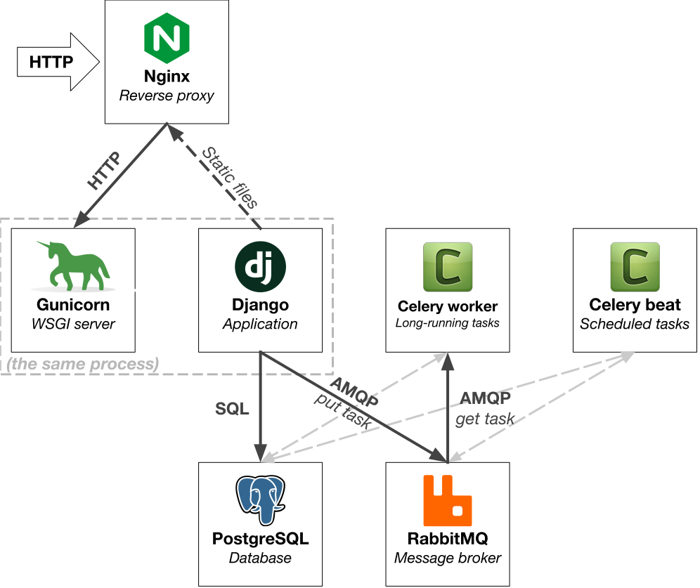
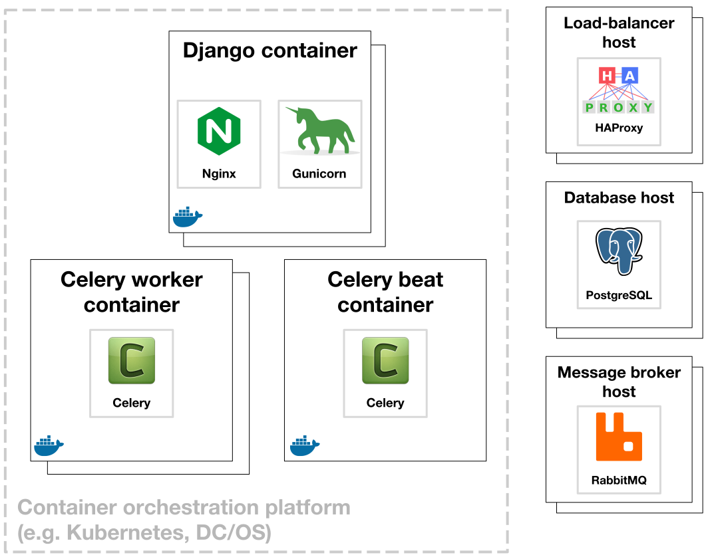

# docker-django-bootstrap

[](https://hub.docker.com/r/praekeltfoundation/django-bootstrap/)
[](https://travis-ci.org/praekeltfoundation/docker-django-bootstrap)

Dockerfile for quickly running Django projects in a Docker container.

Run [Django](https://www.djangoproject.com) projects from source using [Gunicorn](http://gunicorn.org) and [Nginx](http://nginx.org).

Images are available on [Docker Hub](https://hub.docker.com/r/praekeltfoundation/django-bootstrap/). See [Choosing an image tag](#choosing-an-image-tag). All images are tested using [Seaworthy](https://github.com/praekeltfoundation/seaworthy) before release.

> **NOTE:** The `latest`/shorter form tags now track the latest Python and Debian releases. The latest/shorter tags for these images originally pointed to Debian Jessie and Python 2.7 images. This has been updated to match the behaviour of the upstream image tags. You should generally use the most specific tag that you need, for example `py3.6-stretch`.

For more background on running Django in Docker containers, see [this talk](https://www.youtube.com/watch?v=T2hooQzvurQ) ([slides](https://speakerdeck.com/jayh5/deploying-django-web-applications-in-docker-containers)) from PyConZA 2017.

## Index
1. [Usage](#usage)
   - [Step 1: Get your Django project in shape](#step-1-get-your-django-project-in-shape)
   - [Step 2: Write a Dockerfile](#step-2-write-a-dockerfile)
   - [Step 3: Add a .dockerignore file](#step-3-add-a-dockerignore-file-if-copying-in-the-project-source)
   - [Configuring Gunicorn](#configuring-gunicorn)
   - [Running other commands](#running-other-commands)
2. [Celery](#celery)
   - [Option 1: Celery containers](#option-1-celery-containers)
   - [Option 2: Celery in the same container](#option-2-celery-in-the-same-container)
   - [Celery environment variable configuration](#celery-environment-variable-configuration)
3. [Choosing an image tag](#choosing-an-image-tag)
4. [Monitoring and metrics](#monitoring-and-metrics)
   - [Health checks](#health-checks)
5. [Frequently asked questions](#frequently-asked-questions)
   - [How is this deployed?](#how-is-this-deployed)
   - [Why is Nginx needed?](#why-is-nginx-needed)
   - [What about WhiteNoise?](#what-about-whitenoise)
   - [What about Gunicorn's async workers?](#what-about-gunicorns-async-workers)
   - [What about Django Channels?](#what-about-django-channels)
6. [Other configuration](#other-configuration)
   - [Gunicorn](#gunicorn)
   - [Nginx](#nginx)

## Usage
#### Step 1: Get your Django project in shape
There are a few ways that your Django project needs to be set up in order to be compatible with this Docker image.

**setup.py**  
Your project must have a [`setup.py`](https://packaging.python.org/distributing/#setup-py). All dependencies need to be listed in the [`install_requires`](https://packaging.python.org/distributing/#install-requires).

Your dependencies should include at least:
* `Django`
* `celery` (if using)
* ...but **not** `gunicorn`

Django *isn't* installed in this image as different projects may use different versions of Django. Celery is completely optional.

Gunicorn is the only Python package installed in this image. It is kept up-to-date and tested here so you should not be pinning the `gunicorn` package in your application. Gunicorn is considered a deployment detail and your Django project should not rely on its use.

**Static files**  
Your project's [static files](https://docs.djangoproject.com/en/1.10/howto/static-files/) must be set up as follows in your Django settings:
* `STATIC_URL = '/static/'`
* `STATIC_ROOT` = `'static'` (relative) or `'/app/static'` (absolute)

**Media files**  
If your project makes use of user-uploaded media files, it must be set up as follows:
* `MEDIA_URL = '/media/'`
* `MEDIA_ROOT` = `'media'` (relative) or `'/app/media'` (absolute)

> The `staticfiles` and `mediafiles` directories are also used for serving static and media files, but this is deprecated.

***Note:*** Any files stored in directories called `static`, `staticfiles`, `media`, or `mediafiles` in the project root directory (`/app`) will be served by Nginx. Do not store anything here that you do not want the world to see.

**Django settings file**
You'll probably want to make your Django settings file *Docker-friendly* so that the app is easier to deploy on container-based infrastructure. There are a lot of ways to do this and many project-specific considerations, but the [settings file](tests/django2/mysite/docker_settings.py) in the example project is a good place to start and has lots of documentation.

#### Step 2: Write a Dockerfile
In the root of the repo for your Django project, add a Dockerfile for the project. For example, this file could contain:
```dockerfile
FROM praekeltfoundation/django-bootstrap

COPY . /app
RUN pip install -e .

ENV DJANGO_SETTINGS_MODULE my_django_project.settings
ENV CELERY_APP my_django_project

RUN django-admin collectstatic --noinput

CMD ["my_django_project.wsgi:application"]
```

Let's go through these lines one-by-one:
 1. The `FROM` instruction here tells us which image to base this image on. We use the `django-bootstrap` base image.
 2. Copy the source (in the current working directory-- `.`) of your project into the image (`/app` in the container)
 3. Execute (`RUN`) a `pip` command inside the container to install your project from the source
 4. We set the `DJANGO_SETTINGS_MODULE` environment variable so that Django knows where to find its settings. This is necessary for any `django-admin` commands to work.
 5. *Optional:* If you are using Celery, setting the `CELERY_APP` environment variable lets Celery know what app instance to use (i.e. you don't have to provide [`--app`](http://docs.celeryproject.org/en/latest/reference/celery.bin.celery.html#cmdoption-celery-a)).
 6. *Optional:* If you need to run any build-time tasks, such as collecting static assets, now's the time to do that.
 7. We set the container command (`CMD`) to a list of arguments that will be passed to `gunicorn`. We need to provide Gunicorn with the [`APP_MODULE`](http://docs.gunicorn.org/en/stable/run.html?highlight=app_module#gunicorn), so that it knows which WSGI app to run.*

> Note that previously the way to do point 5 was to set the `APP_MODULE` environment variable. That still works, but is no longer the recommended way and is deprecated.

By default, the [`django-entrypoint.sh`](django-entrypoint.sh) script is run when the container is started. This script runs a once-off `django-admin migrate` to update the database schemas and then launches `nginx` and `gunicorn` to run the application.

The script also allows you to create a Django super user account if needed. Setting the `SUPERUSER_PASSWORD` environment variable will result in a Django superuser account being made with the `admin` username. This will only happen if no `admin` user exists.

By default the script will run the migrations when starting up. This may not be desirable in all situations. If you want to run migrations separately using `django-admin` then setting the `SKIP_MIGRATIONS` environment variable will result in them not being run.

#### Step 3: Add a `.dockerignore` file (if copying in the project source)
If you are copying the full source of your project into your Docker image (i.e. doing `COPY . /app`), then it is important to add a `.dockerignore` file.

Add a file called `.dockerignore` to the root of your project. A good start is just to copy in the [`.dockerignore` file](tests/.dockerignore) from the example Django project in this repo.

When copying in the source of your project, some of those files probably *aren't* needed inside the Docker image you're building. We tell Docker about those unneeded files using a `.dockerignore` file, much like how one would tell Git not to track files using a `.gitignore` file.

As a general rule, you should list all the files in your `.gitignore` in your `.dockerignore` file. If you don't need it in Git, you shouldn't need it in Docker.

Additionally, you shouldn't need any *Git* stuff inside your Docker image. It's especially important to have Docker ignore the `.git` directory because every Git operation you perform will result in files changing in that directory (whether you end up in the same state in Git as you were previously or not). This could result in unnecessary invalidation of Docker's cached image layers.

**NOTE:** Unlike `.gitignore` files, `.dockerignore` files do *not* apply recursively to subdirectories. So, for example, while the entry `*.pyc` in a `.gitignore` file will cause Git to ignore `./abc.pyc` and `./def/ghi.pyc`, in a `.dockerignore` file, that entry will cause Docker to ignore only `./abc.pyc`. This is very unfortunate. In order to get the same behaviour from a `.dockerignore` file, you need to add an extra leading `**/` glob pattern — i.e. `**/*.pyc`. For more information on the `.dockerignore` file syntax, see the [Docker documentation](https://docs.docker.com/engine/reference/builder/#dockerignore-file).

### Configuring Gunicorn
The recommended way to specify additional Gunicorn arguments is by using the `CMD` directive in your Dockerfile:
```dockerfile
CMD ["my_django_project.wsgi:application", "--timeout", "1800"]
```
Alternatively, this can also be done at runtime:
```
> $ docker run my-django-bootstrap-image my_django_project.wsgi:application --timeout 1800
```

Note that, since Gunicorn 19.7.0, the `GUNICORN_CMD_ARGS` environment variable can also be used to specify arguments:
```dockerfile
ENV GUNICORN_CMD_ARGS "--timeout 1800"
```
Or at runtime:
```
> $ docker run -e GUNICORN_CMD_ARGS="--timeout 1800" my-django-bootstrap-image my_django_project.wsgi:application
```
Arguments specified via the CLI (i.e. `CMD`) will take precedence over arguments specified via this environment variable.

See all the settings available for Gunicorn [here](http://docs.gunicorn.org/en/latest/settings.html). A common setting is the number of Gunicorn workers which can be set with the `WEB_CONCURRENCY` environment variable.

Gunicorn can also be configured using a [configuration file](http://docs.gunicorn.org/en/latest/configure.html#configuration-file). We **do not recommend** this because django-bootstrap already uses a config file to set [some basic options for Gunicorn](#gunicorn). Note that the config file has the _lowest_ precedence of all the configuration methods so any option specified through either the CLI or the environment variable will override the same option in the config file.

Gunicorn in this image is essentially hard-coded to use a config file at `/gunicorn_conf.py`. If you _must_ use your own config file, you could overwrite that file.

### Running other commands
You can skip the execution of the `django-entrypoint.sh` script bootstrapping processes and run other commands by overriding the container's launch command.

You can do this at image build-time by setting the `CMD` directive in your Dockerfile...
```dockerfile
CMD ["django-admin", "runserver"]
```
...or at runtime by passing an argument to the `docker run` command:
```
> $ docker run my-django-bootstrap-image django-admin runserver
```


If the entrypoint script sees a command for `gunicorn` then it will run all bootstrapping processes (database migration, starting Nginx, etc.). Otherwise, the script will execute the command directly. A special case is Celery, which is described next.

Note that overwriting the `django-entrypoint.sh` script with a new file is **not supported**. Code in django-bootstrap may change at any time and break compatibility with a custom entrypoint script.

## Celery
It's common for Django applications to have [Celery](http://docs.celeryproject.org/en/latest/django/first-steps-with-django.html) workers performing tasks alongside the actual website. Using this image, there are 2 different ways to run Celery:

 1. Run separate containers for Celery (recommended)
 2. Run Celery alongside the Django site inside the same container (simpler)

In most cases it makes sense to run each Celery process in a container separate from the Django/Gunicorn one, so as to follow the rule of one(*-ish*) process per container. But in some cases, running a whole bunch of containers for a relatively simple site may be overkill. Additional containers generally have some overhead in terms of CPU and, especially, memory usage.

Note that, as with Django, your project needs to specify Celery in its `install_requires` in order to use Celery. Celery is not installed in this image by default.

### Option 1: Celery containers
To run a Celery container simply override the container command as described earlier. If the `django-entrypoint.sh` script sees a `celery` command, it will instead run the command using the [`celery-entrypoint.sh`](celery-entrypoint.sh) script. This script switches to the correct user to run Celery and sets some basic config options, depending on which Celery command is being run.

You can override the command in your Dockerfile...
```dockerfile
CMD ["celery", "worker"]
```
...or at runtime:
```
> $ docker run my-django-bootstrap-image celery worker
```

You can also create dedicated Celery images by overriding the image entrypoint:
```dockerfile
ENTRYPOINT ["dinit", "celery-entrypoint.sh"]
CMD ["worker"]
```
The above assume that you have set the `CELERY_APP` environment variable.

### Option 2: Celery in the same container
Celery can be run alongside Django/Gunicorn by adjusting a set of environment variables. Setting the `CELERY_WORKER` variable to a non-empty value will enable a Celery worker process. Similarly, setting the `CELERY_BEAT` variable will enable a Celery beat process.

#### `CELERY_WORKER`:
Set this option to any non-empty value (e.g. `1`) to have a [Celery worker](http://docs.celeryproject.org/en/latest/userguide/workers.html)  process run. This requires that `CELERY_APP` is set.
* Required: no
* Default: none
* Celery option: n/a

#### `CELERY_BEAT`:
Set this option to any non-empty value (e.g. `1`) to have a [Celery beat](http://docs.celeryproject.org/en/latest/userguide/periodic-tasks.html) process run. This requires that `CELERY_APP` is set.
* Required: no
* Default: none
* Celery option: n/a

Note that when running a Celery worker in this way, the process pool implementation used is the ['solo' pool](http://docs.celeryproject.org/en/latest/internals/reference/celery.concurrency.solo.html). This means that instead of a pair of processes (master/worker) for the Celery worker, there is just one process. This saves on resources.

The worker is always single-process (the `--concurrency` option is ignored) and is **blocking**. A number of worker configuration options can't be used with this pool implementation. See the [worker guide](http://docs.celeryproject.org/en/latest/userguide/workers.html) in the Celery documentation for more information.

### Celery environment variable configuration
The following environment variables can be used to configure Celery, but, other than the `CELERY_APP` variable, you should configure Celery in your Django settings file. See the example project's [settings file](example/mysite/docker_settings.py) for an example of how to do that.

#### `CELERY_APP`:
* Required: yes, if `CELERY_WORKER` or `CELERY_BEAT` is set.
* Default: none
* Celery option: `-A`/`--app`

<details>
  <summary>Deprecated environment variables</summary>
  <blockquote><b>NOTE</b>: The following 3 environment variables are deprecated. They will continue to work for now but it is recommended that you set these values in your Django settings file rather.</blockquote>

  <h4><code>CELERY_BROKER</code>:</h4>
  <ul>
    <li>Required: no</li>
    <li>Default: none</li>
    <li>Celery option: <code>-b</code>/<code>--broker</code></li>
  </ul>

  <h4><code>CELERY_LOGLEVEL</code>:</h4>
  <ul>
  <li>Required: no</li>
  <li>Default: none</li>
  <li>Celery option: <code>-l</code>/<code>--loglevel</code></li>
  </ul>

  <h4><code>CELERY_CONCURRENCY</code>:</h4>
  <ul>
  <li>Required: no</li>
  <li>Default: <b>1</b></li>
  <li>Celery option: <code>-c</code>/<code>--concurrency</code></li>
  </ul>

</details>

#### A note on worker processes
By default Celery runs as many worker processes as there are processors. **We instead default to 1 worker process** in this image to ensure containers use a consistent and small amount of resources no matter what kind of host the containers happen to run on.

If you need more Celery worker processes, you have the choice of either upping the processes per container or running multiple container instances.

## Choosing an image tag
The following tags are available:

|                    | Python 2.7                                  | Python 3.6              | Python 3.7                                                     |
|--------------------|---------------------------------------------|-------------------------|----------------------------------------------------------------|
| **Debian Jessie**  | `py2.7-jessie` `py2-jessie` `jessie`        | `py3.6-jessie`          | N/A                                                            |
| **Debian Stretch** | `py2.7-stretch` `py2-stretch` `py2.7` `py2` | `py3.6-stretch` `py3.6` | `py3.7-stretch` `py3-stretch` `stretch` `py3.7` `py3` `latest` |

It's recommended that you pick the most specific tag for what you need, as shorter tags are likely to change their Python and Debian versions over time. `py3` tags currently track the latest Python 3.x version. The default Python version is Python 2.7 and the default operating system is Debian Jessie, but these are likely to change in the future.

## Monitoring and metrics
django-bootstrap doesn't implement or mandate any particular monitoring or metrics setup, but we can suggest some ways to go about instrumenting a container based on django-bootstrap.

### Health checks
Health checks are important to implement when using an automated container orchestration system like Kubernetes or DC/OS. Health checks can allow these systems to wait for a container to become completely ready before routing user requests to the container. Containers can also be restarted if their health checks start failing.

There are a few popular libraries available for implementing health checks in Django, such as:
* [`django-health-check`](https://github.com/KristianOellegaard/django-health-check)
* [`django-watchman`](https://github.com/mwarkentin/django-watchman)
* [`django-healthchecks`](https://github.com/mvantellingen/django-healthchecks)

The [example Django projects](tests) we use to test `django-bootstrap` use a very basic configuration of [`django-health-check`](https://github.com/KristianOellegaard/django-health-check). Health checks can also be implemented from scratch in Django quite easily.

## Frequently asked questions
### How is this deployed?
This will depend very much on your infrastructure. This Docker image was designed with an architecture like this in mind:



django-bootstrap does not require that you use PostgreSQL or RabbitMQ. You can configure Django however you would like, those are just the systems we use with it.

The image was also designed to be used with a container orchestration system. We use Mesosphere DC/OS but it should work just as well on Kubernetes. We run services that require persistent storage, such as databases or message brokers, outside of our container orchestration system. This looks something like this:



Generally a single image based on django-bootstrap takes on the role of running Django or Celery depending on how each container running the image is configured.

### Why is Nginx needed?
The primary reason Nginx is necessary is that a key part of Gunicorn's design relies on a proxy to buffer incoming requests. This design goes back to the original [design of Unicorn for Ruby](https://bogomips.org/unicorn/DESIGN.html):
> [...] neither keepalive nor pipelining are supported. These aren't needed since Unicorn is only designed to serve fast, low-latency clients directly. Do one thing, do it well; let nginx handle slow clients.

You can also read about this in [Gunicorn's design documentation](http://docs.gunicorn.org/en/latest/design.html). So, when using Gunicorn (with the default "sync workers"), it's critical that a buffering proxy (such as Nginx) is used.

In addition to this reason, Nginx is used to perform the following functions:
* Serves static files for Django which it can do very efficiently, rather than requiring Python code to do so.
* Performs some basic optimisations such as gzipping responses, setting some cache-control headers for static files, etc.
* Adjusts some headers received by clients (see [Other configuration: Nginx](#nginx)).

### What about WhiteNoise?
[WhiteNoise](http://whitenoise.evans.io) is a library to simplify static file serving with Python webservers that integrates with Django. It encapsulates a lot of best-practices and useful optimisations when serving static files. In fact, some of the optimisations it uses we copied and used in the Nginx configuration for django-bootstrap.

WhiteNoise is not typically used in conjunction with a static file-serving reverse proxy and so we don't recommend using it with django-bootstrap. Additionally, WhiteNoise [does not support serving Django media files](http://whitenoise.evans.io/en/stable/django.html#serving-media-files)--which is **not** a thing we recommend you do, for the reasons outlined in the WhiteNoise documentation--but a requirement we have had for some of our projects.

WhiteNoise does not solve the problem of buffering requests for Gunicorn's workers.

### What about Gunicorn's async workers?
Gunicorn does provide various implementations of asynchronous workers. See [Choosing a Worker Type](http://docs.gunicorn.org/en/latest/design.html#choosing-a-worker-type). These asynchronous workers can work well with django-bootstrap.

When using async workers, it could be more practical to use WhiteNoise without Nginx, but that is beyond the scope of this project.

The sync worker type is simple, easy to reason about, and can scale well when deployed properly and used for its intended purpose.

### What about Django Channels?
[Django Channels](https://channels.readthedocs.io) extends Django for protocols beyond HTTP/1.1 and generally enables Django to be used for more asynchronous applications. Django Channels does not use WSGI and instead uses a protocol called [Asynchronous Server Gateway Interface (ASGI)](https://channels.readthedocs.io/en/latest/asgi.html). Gunicorn does not support ASGI and instead the reference ASGI server implementation, [Daphne](https://github.com/django/daphne/), is typically used instead.

Django Channels is beyond the scope of this project. We may one day start a `docker-django-channels` project, though :wink:.

### What about using container groups (i.e. pods)?
django-bootstrap currently runs both Nginx and Gunicorn processes in the same container. It is generally considered best-practice to run only one thing inside a container. Technically, it would be possible to run Nginx and Gunicorn in separate containers that are grouped together and share some volumes. The idea of a "pod" of containers was popularised by Kubernetes. Containers in a pod are typically co-located, so sharing files between the containers is practical:


This is a direction we want to take the project, but currently our infrastructure does not support the pod pattern. We have experimented with this [before](https://github.com/praekeltfoundation/docker-django-bootstrap/pull/69) and would welcome pull requests.

## Other configuration
### Gunicorn
Gunicorn is run with some basic configuration using the config file at [`/gunicorn_conf.py`](gunicorn_conf.py):
* Listens on a Unix socket at `/run/gunicorn/gunicorn.sock`
* Places a PID file at `/run/gunicorn/gunicorn.pid`
* [Worker temporary files](http://docs.gunicorn.org/en/latest/settings.html#worker-tmp-dir) are placed in `/run/gunicorn`
* Access logs can be logged to stderr by setting the `GUNICORN_ACCESS_LOGS` environment variable to a non-empty value.

### Nginx
Nginx is set up with mostly default config:
* Access logs are sent to stdout, error logs to stderr and log messages are formatted to be JSON-compatible for easy parsing.
* Listens on port 8000 (and this port is exposed in the Dockerfile)
* Has gzip compression enabled for most common, compressible mime types
* Serves files from `/static/` and `/media/`
* All other requests are proxied to the Gunicorn socket

Generally you shouldn't need to adjust Nginx's settings. If you do, the configuration is split into several files that can be overridden individually:
* `/etc/nginx/nginx.conf`: Main configuration (including logging and gzip compression)
* `/etc/nginx/conf.d/`
  * `django.conf`: The primary server configuration
  * `django.conf.d/`
    * `upstream.conf`: Upstream connection to Gunicorn
    * `locations/*.conf`: Each server location (static, media, root)
    * `maps/*.conf`: Nginx maps for setting variables

We make a few adjustments to Nginx's default configuration to better work with Gunicorn. See the [config file](nginx/conf.d/django.conf) for all the details. One important point is that we consider the `X-Forwarded-Proto` header, when set to the value of `https`, as an indicator that the client connection was made over HTTPS and is secure. Gunicorn considers a few more headers for this purpose, `X-Forwarded-Protocol` and `X-Forwarded-Ssl`, but our Nginx config is set to remove those headers to prevent misuse.
